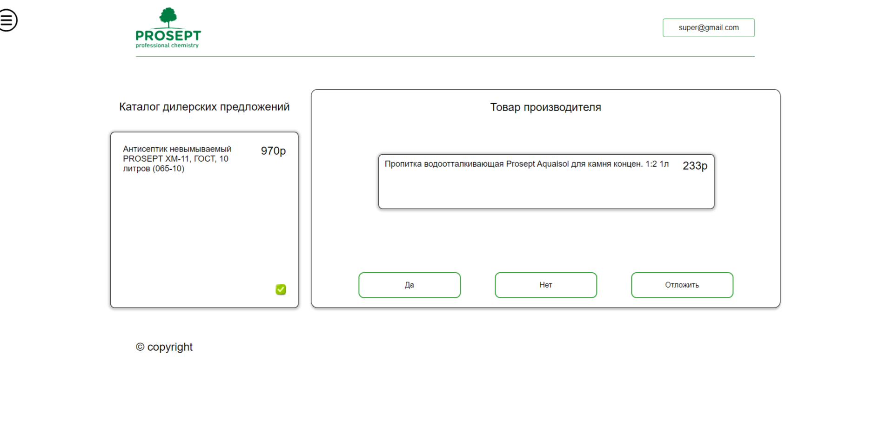
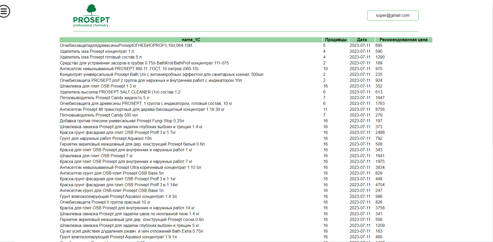
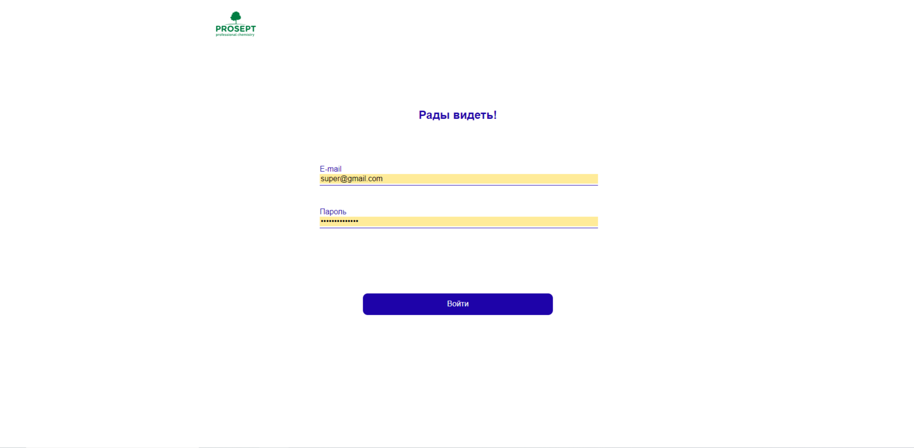

# React + Vite

1. npm i

2. npm run start

# Проект: Прототип приложения для производителя бытовой химии

## [Открыть страницу](http://81.31.246.233:5173/)

## Шаблоны приложения:

## Описание проекта:

_Цель этого проекта - разработка решения, которое отчасти автоматизирует процесс_
_сопоставления товаров. Основная идея - предлагать несколько товаров заказчика_
_которые с наибольшей вероятностью соответствуют размечаемому товару дилера._

### Используемые инструменты.

- Redux Toolkit
- React + Vite.
- Axios.

#### Чем можно дополнить:

1. Страница со статистикой работы оператора.
2. Адаптивная верстка
